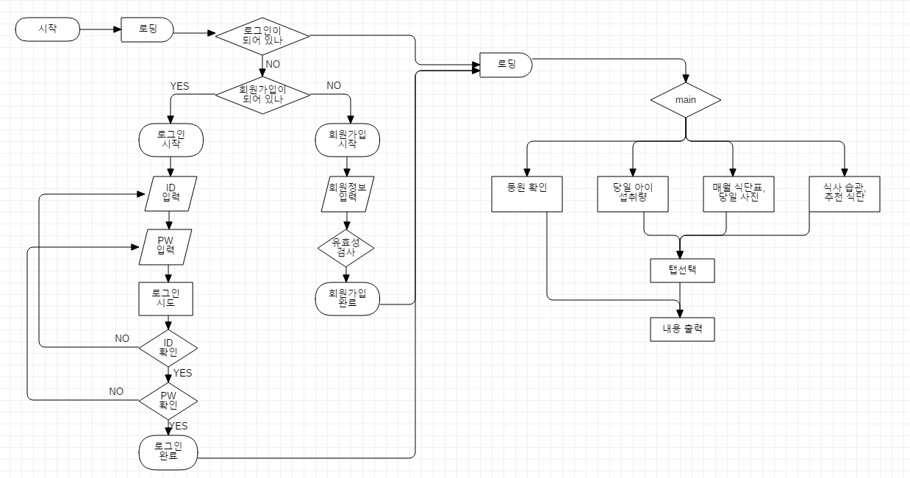

#  Checkers-IoT

:sunny: 균형 있는 식습관을 위한 메뉴추천시스템 체커스 :cloud:  

---

# 1. 화면흐름도 

	

---

# 2. System Architecture  

	

---

# 3. Main Function  

- 메뉴 별 무게 측정
- 어린이집 당일 식단 사진
- 어린이집 월간 식단표
- 어린이의 당일 섭취량
- 아이의 식습관 패턴
- 식습관에 따른 추천 메뉴

---

# 4. Team Role  
#### :beer: 남궁권 ([kkoon9](https://github.com/kkoon9))  
  * 로드셀 센서와 아두이노를 활용한 무게 측정 구현에 필요한 영점 조절 및 오프셋 조절
  * 라즈베리파이와 아두이노 TCP/IP 통신 구현
  * 데이터베이스 분석과 웹 서버 운용에 필요한 데이터베이스 구축 및 구성
  * 웹 서버 구현 및 어플리케이션의 연동
  * 아이의 식습관 추천을 위한 메뉴 클러스터링
#### :cocktail: 최진민 ([JinMinChoi](https://github.com/JinMinChoi))  
  * 모바일 어플리케이션 제작, 모바일 어플리케이션 디자인 구성 및 구현, 웹 서버와 어플리케이션의 연동
#### :tropical_drink: 김수민
  * 식판과 중간 노드간의 지그비 통신 구현
  
---

# 5. Develop Framework & Environment

* [Arduino](https://www.arduino.cc/) - 무게 측정을 위한 로드셀 센서 사용
* [raspberrypi](https://www.raspberrypi.org/) - 아두이노와 DB 서버 TCP/IP 통신 구현을 위해 사용
* [Python 3](https://www.python.org/) - 식습관 추천을 위한 메뉴 클러스터링을 위해 사용
* [vscode](https://code.visualstudio.com/) - 편집기
* [MySQL](https://www.mysql.com/) - DataBase
* [MySQL Workbench](https://www.mysql.com/products/workbench/) - MySQL 시각화 툴
* [Jupyter Notebook](https://jupyter.org/) - 편집기

---
